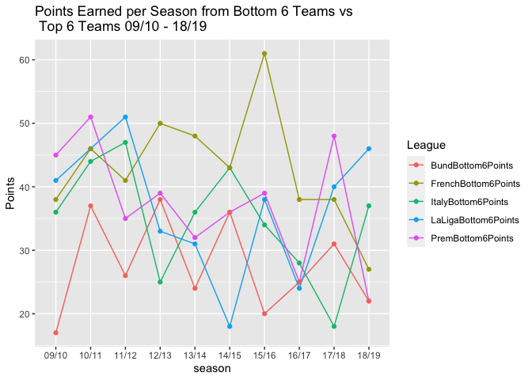

This document is meant to analyze soccer data in Europes Top 5 European League from the 09/10 season to the 18/19 season. The idea is touch on the competitiveness of each league. What does competitive actually mean? 

Competitiveness is a vague term - we will look at winners, top 4 contenders and points earned from the bottom teams from the top teams to compare whether one league really shines or dulls compared to the others. 

This analysis is conducted using a combination of R programming & SQL. Please view the code file if you want a more in-depth look at my code. This markdown file will only present final outputs such as tables & graphs.  


# Let's Start with the Premier League

## Premier League Tables 09/10 - 18/19 {.tabset}

### 09/10 


|Team        | Points|
|:-----------|------:|
|Chelsea     |     86|
|Man United  |     85|
|Arsenal     |     75|
|Tottenham   |     70|
|Man City    |     67|
|Aston Villa |     64|
|Liverpool   |     63|
|Everton     |     61|
|Birmingham  |     50|
|Blackburn   |     50|
|Stoke       |     47|
|Fulham      |     46|
|Sunderland  |     44|
|Bolton      |     39|
|Wolves      |     38|
|Wigan       |     36|
|West Ham    |     35|
|Burnley     |     30|
|Hull        |     30|
|Portsmouth  |     28|


### 10/11 


|Team        | Points|
|:-----------|------:|
|Man United  |     80|
|Chelsea     |     71|
|Man City    |     71|
|Arsenal     |     68|
|Tottenham   |     62|
|Liverpool   |     58|
|Everton     |     54|
|Fulham      |     49|
|Aston Villa |     48|
|Sunderland  |     47|
|West Brom   |     47|
|Bolton      |     46|
|Newcastle   |     46|
|Stoke       |     46|
|Blackburn   |     43|
|Wigan       |     42|
|Wolves      |     40|
|Birmingham  |     39|
|Blackpool   |     39|
|West Ham    |     33|


### 11/12 


|Team        | Points|
|:-----------|------:|
|Man City    |     89|
|Man United  |     89|
|Arsenal     |     70|
|Tottenham   |     69|
|Newcastle   |     65|
|Chelsea     |     64|
|Everton     |     56|
|Fulham      |     52|
|Liverpool   |     52|
|Norwich     |     47|
|Swansea     |     47|
|West Brom   |     47|
|Stoke       |     45|
|Sunderland  |     45|
|Wigan       |     43|
|Aston Villa |     38|
|QPR         |     37|
|Bolton      |     36|
|Blackburn   |     31|
|Wolves      |     25|


### 12/13 


|Team        | Points|
|:-----------|------:|
|Man United  |     89|
|Man City    |     78|
|Chelsea     |     75|
|Arsenal     |     73|
|Tottenham   |     72|
|Everton     |     63|
|Liverpool   |     61|
|West Brom   |     49|
|Swansea     |     46|
|West Ham    |     46|
|Norwich     |     44|
|Fulham      |     43|
|Stoke       |     42|
|Aston Villa |     41|
|Newcastle   |     41|
|Southampton |     41|
|Sunderland  |     39|
|Wigan       |     36|
|Reading     |     28|
|QPR         |     25|


### 13/14 


|Team           | Points|
|:--------------|------:|
|Man City       |     86|
|Liverpool      |     84|
|Chelsea        |     82|
|Arsenal        |     79|
|Everton        |     72|
|Tottenham      |     69|
|Man United     |     64|
|Southampton    |     56|
|Stoke          |     50|
|Newcastle      |     49|
|Crystal Palace |     45|
|Swansea        |     42|
|West Ham       |     40|
|Aston Villa    |     38|
|Sunderland     |     38|
|Hull           |     37|
|West Brom      |     36|
|Norwich        |     33|
|Fulham         |     32|
|Cardiff        |     30|


### 14/15 


|Team           | Points|
|:--------------|------:|
|Chelsea        |     87|
|Man City       |     79|
|Arsenal        |     75|
|Man United     |     70|
|Tottenham      |     64|
|Liverpool      |     62|
|Southampton    |     60|
|Swansea        |     56|
|Stoke          |     54|
|Crystal Palace |     48|
|Everton        |     47|
|West Ham       |     47|
|West Brom      |     44|
|Leicester      |     41|
|Newcastle      |     39|
|Aston Villa    |     38|
|Sunderland     |     38|
|Hull           |     35|
|Burnley        |     33|
|QPR            |     30|


### 15/16 


|Team           | Points|
|:--------------|------:|
|Leicester      |     81|
|Arsenal        |     71|
|Tottenham      |     70|
|Man City       |     66|
|Man United     |     66|
|Southampton    |     63|
|West Ham       |     62|
|Liverpool      |     60|
|Stoke          |     51|
|Chelsea        |     50|
|Everton        |     47|
|Swansea        |     47|
|Watford        |     45|
|West Brom      |     43|
|Bournemouth    |     42|
|Crystal Palace |     42|
|Sunderland     |     39|
|Newcastle      |     37|
|Norwich        |     34|
|Aston Villa    |     17|


### 16/17 


|Team           | Points|
|:--------------|------:|
|Chelsea        |     93|
|Tottenham      |     86|
|Man City       |     78|
|Liverpool      |     76|
|Arsenal        |     75|
|Man United     |     69|
|Everton        |     61|
|Bournemouth    |     46|
|Southampton    |     46|
|West Brom      |     45|
|West Ham       |     45|
|Leicester      |     44|
|Stoke          |     44|
|Crystal Palace |     41|
|Swansea        |     41|
|Burnley        |     40|
|Watford        |     40|
|Hull           |     34|
|Middlesbrough  |     28|
|Sunderland     |     24|


### 17/18 


|Team           | Points|
|:--------------|------:|
|Man City       |    100|
|Man United     |     81|
|Tottenham      |     77|
|Liverpool      |     75|
|Chelsea        |     70|
|Arsenal        |     63|
|Burnley        |     54|
|Everton        |     49|
|Leicester      |     47|
|Bournemouth    |     44|
|Crystal Palace |     44|
|Newcastle      |     44|
|West Ham       |     42|
|Watford        |     41|
|Brighton       |     40|
|Huddersfield   |     37|
|Southampton    |     36|
|Stoke          |     33|
|Swansea        |     33|
|West Brom      |     31|


### 18/19 


|Team           | Points|
|:--------------|------:|
|Man City       |     98|
|Liverpool      |     97|
|Chelsea        |     72|
|Tottenham      |     71|
|Arsenal        |     70|
|Man United     |     66|
|Wolves         |     57|
|Everton        |     54|
|Leicester      |     52|
|West Ham       |     52|
|Watford        |     50|
|Crystal Palace |     49|
|Bournemouth    |     45|
|Newcastle      |     45|
|Burnley        |     40|
|Southampton    |     39|
|Brighton       |     36|
|Cardiff        |     34|
|Fulham         |     26|
|Huddersfield   |     16|

## Premier League Winner's & Top 4 09/10 - 18/19


```
     Champion season
1     Chelsea  09/10
2  Man United  10/11
3    Man City  11/12
4  Man United  12/13
5    Man City  13/14
6     Chelsea  14/15
7   Leicester  15/16
8     Chelsea  16/17
9  Man United  17/18
10   Man City  18/19
```

```
        Team Top4Finishes
1   Man City            8
2    Chelsea            8
3    Arsenal            7
4  Tottenham            6
5 Man United            6
6  Liverpool            4
7  Leicester            1
```

This is why people enjoy watching the PL. 10 seasons, no team was ever champion twice in a row during this time. However, in the context of the top 4, this is largely fought between 5 teams during this period. This may indicate more of a gap between the top 4-5 teams and the mid table sides.

# Let's move on to the German Bundesliga

## Bundesliga Tables 09/10 - 18/19 {.tabset}

### 09/10 


|Team          | Points|
|:-------------|------:|
|Bayern Munich |     70|
|Schalke 04    |     65|
|Werder Bremen |     61|
|Leverkusen    |     59|
|Dortmund      |     57|
|Stuttgart     |     55|
|Hamburg       |     52|
|Wolfsburg     |     50|
|Mainz         |     47|
|Ein Frankfurt |     46|
|Hoffenheim    |     42|
|M'gladbach    |     39|
|FC Koln       |     38|
|Freiburg      |     35|
|Hannover      |     33|
|Nurnberg      |     31|
|Bochum        |     28|
|Hertha        |     24|


### 10/11 


|Team           | Points|
|:--------------|------:|
|Dortmund       |     75|
|Leverkusen     |     68|
|Bayern Munich  |     65|
|Hannover       |     60|
|Mainz          |     58|
|Nurnberg       |     47|
|Kaiserslautern |     46|
|Hamburg        |     45|
|FC Koln        |     44|
|Freiburg       |     44|
|Hoffenheim     |     43|
|Stuttgart      |     42|
|Werder Bremen  |     41|
|Schalke 04     |     40|
|Wolfsburg      |     38|
|M'gladbach     |     36|
|Ein Frankfurt  |     34|
|St Pauli       |     29|


### 11/12 


|Team           | Points|
|:--------------|------:|
|Dortmund       |     81|
|Bayern Munich  |     73|
|Schalke 04     |     64|
|M'gladbach     |     60|
|Leverkusen     |     54|
|Stuttgart      |     53|
|Hannover       |     48|
|Wolfsburg      |     44|
|Nurnberg       |     42|
|Werder Bremen  |     42|
|Hoffenheim     |     41|
|Freiburg       |     40|
|Mainz          |     39|
|Augsburg       |     38|
|Hamburg        |     36|
|Hertha         |     31|
|FC Koln        |     30|
|Kaiserslautern |     23|


### 12/13 


|Team               | Points|
|:------------------|------:|
|Bayern Munich      |     91|
|Dortmund           |     66|
|Leverkusen         |     65|
|Schalke 04         |     55|
|Ein Frankfurt      |     51|
|Freiburg           |     51|
|Hamburg            |     48|
|M'gladbach         |     47|
|Hannover           |     45|
|Nurnberg           |     44|
|Stuttgart          |     43|
|Wolfsburg          |     43|
|Mainz              |     42|
|Werder Bremen      |     34|
|Augsburg           |     33|
|Hoffenheim         |     31|
|Fortuna Dusseldorf |     30|
|Greuther Furth     |     21|


### 13/14 


|Team          | Points|
|:-------------|------:|
|Bayern Munich |     90|
|Dortmund      |     71|
|Schalke 04    |     64|
|Leverkusen    |     61|
|Wolfsburg     |     60|
|M'gladbach    |     55|
|Mainz         |     53|
|Augsburg      |     52|
|Hoffenheim    |     44|
|Hannover      |     42|
|Hertha        |     41|
|Werder Bremen |     39|
|Ein Frankfurt |     36|
|Freiburg      |     36|
|Stuttgart     |     32|
|Hamburg       |     27|
|Nurnberg      |     26|
|Braunschweig  |     25|


### 14/15 


|Team          | Points|
|:-------------|------:|
|Bayern Munich |     79|
|Wolfsburg     |     69|
|M'gladbach    |     66|
|Leverkusen    |     61|
|Augsburg      |     49|
|Schalke 04    |     48|
|Dortmund      |     46|
|Hoffenheim    |     44|
|Ein Frankfurt |     43|
|Werder Bremen |     43|
|FC Koln       |     40|
|Mainz         |     40|
|Hannover      |     37|
|Stuttgart     |     36|
|Hamburg       |     35|
|Hertha        |     35|
|Freiburg      |     34|
|Paderborn     |     31|


### 15/16 


|Team          | Points|
|:-------------|------:|
|Bayern Munich |     88|
|Dortmund      |     78|
|Leverkusen    |     60|
|M'gladbach    |     55|
|Schalke 04    |     52|
|Hertha        |     50|
|Mainz         |     50|
|Wolfsburg     |     45|
|FC Koln       |     43|
|Hamburg       |     41|
|Ingolstadt    |     40|
|Augsburg      |     38|
|Darmstadt     |     38|
|Werder Bremen |     38|
|Hoffenheim    |     37|
|Ein Frankfurt |     36|
|Stuttgart     |     33|
|Hannover      |     25|


### 16/17 


|Team          | Points|
|:-------------|------:|
|Bayern Munich |     82|
|RB Leipzig    |     67|
|Dortmund      |     64|
|Hoffenheim    |     62|
|FC Koln       |     49|
|Hertha        |     49|
|Freiburg      |     48|
|M'gladbach    |     45|
|Werder Bremen |     45|
|Schalke 04    |     43|
|Ein Frankfurt |     42|
|Leverkusen    |     41|
|Augsburg      |     38|
|Hamburg       |     38|
|Mainz         |     37|
|Wolfsburg     |     37|
|Ingolstadt    |     32|
|Darmstadt     |     25|


### 17/18 


|Team          | Points|
|:-------------|------:|
|Bayern Munich |     84|
|Schalke 04    |     63|
|Dortmund      |     55|
|Hoffenheim    |     55|
|Leverkusen    |     55|
|RB Leipzig    |     53|
|Stuttgart     |     51|
|Ein Frankfurt |     49|
|M'gladbach    |     47|
|Hertha        |     43|
|Werder Bremen |     42|
|Augsburg      |     41|
|Hannover      |     39|
|Freiburg      |     36|
|Mainz         |     36|
|Wolfsburg     |     33|
|Hamburg       |     31|
|FC Koln       |     22|


### 18/19 


|Team               | Points|
|:------------------|------:|
|Bayern Munich      |     78|
|Dortmund           |     76|
|RB Leipzig         |     66|
|Leverkusen         |     58|
|M'gladbach         |     55|
|Wolfsburg          |     55|
|Ein Frankfurt      |     54|
|Werder Bremen      |     53|
|Hoffenheim         |     51|
|Fortuna Dusseldorf |     44|
|Hertha             |     43|
|Mainz              |     43|
|Freiburg           |     36|
|Schalke 04         |     33|
|Augsburg           |     32|
|Stuttgart          |     28|
|Hannover           |     21|
|Nurnberg           |     19|

## Bundesliga Winner's & Top 4 09/10 - 18/19


```
        Champion season
1  Bayern Munich  09/10
2       Dortmund  10/11
3       Dortmund  11/12
4  Bayern Munich  12/13
5  Bayern Munich  13/14
6  Bayern Munich  14/15
7  Bayern Munich  15/16
8  Bayern Munich  16/17
9  Bayern Munich  17/18
10 Bayern Munich  18/19
```

```
            Team Top4Finishes
1  Bayern Munich           10
2       Dortmund            7
3     Leverkusen            6
4     Schalke 04            5
5     M'gladbach            4
6     RB Leipzig            2
7     Hoffenheim            2
8      Wolfsburg            1
9  Werder Bremen            1
10      Hannover            1
11 Ein Frankfurt            1
```

This is why the Bundesliga comes under much scrutiny. Bayern Munich dominates this league and was champions 8/10 times during this period. The top 4 is a bit more interesting though. You see a few more teams getting into these positions than the premier league, identifying that after Bayern, there is a bit more balance to the 2nd through mid table positions. 


# Italian Serie A

## Serie A Tables 09/10 - 18/19 {.tabset}

### 09/10 


|Team       | Points|
|:----------|------:|
|Inter      |     82|
|Roma       |     80|
|Milan      |     70|
|Sampdoria  |     67|
|Palermo    |     65|
|Napoli     |     59|
|Juventus   |     55|
|Parma      |     52|
|Genoa      |     51|
|Bari       |     50|
|Fiorentina |     47|
|Lazio      |     46|
|Catania    |     45|
|Cagliari   |     44|
|Chievo     |     44|
|Udinese    |     44|
|Bologna    |     42|
|Atalanta   |     35|
|Siena      |     31|
|Livorno    |     29|


### 10/11 


|Team       | Points|
|:----------|------:|
|Milan      |     82|
|Inter      |     76|
|Napoli     |     70|
|Lazio      |     66|
|Udinese    |     66|
|Roma       |     63|
|Juventus   |     58|
|Palermo    |     56|
|Fiorentina |     51|
|Genoa      |     51|
|Catania    |     46|
|Chievo     |     46|
|Parma      |     46|
|Bologna    |     45|
|Cagliari   |     45|
|Cesena     |     43|
|Lecce      |     41|
|Sampdoria  |     36|
|Brescia    |     32|
|Bari       |     24|


### 11/12 


|Team       | Points|
|:----------|------:|
|Juventus   |     84|
|Milan      |     80|
|Udinese    |     64|
|Lazio      |     62|
|Napoli     |     61|
|Inter      |     58|
|Parma      |     56|
|Roma       |     56|
|Atalanta   |     52|
|Bologna    |     51|
|Chievo     |     49|
|Catania    |     48|
|Fiorentina |     46|
|Siena      |     44|
|Cagliari   |     43|
|Palermo    |     43|
|Genoa      |     42|
|Lecce      |     36|
|Novara     |     32|
|Cesena     |     22|


### 12/13 


|Team       | Points|
|:----------|------:|
|Juventus   |     87|
|Napoli     |     78|
|Milan      |     72|
|Fiorentina |     70|
|Udinese    |     66|
|Roma       |     62|
|Lazio      |     61|
|Catania    |     56|
|Inter      |     54|
|Parma      |     49|
|Cagliari   |     47|
|Chievo     |     45|
|Bologna    |     44|
|Sampdoria  |     43|
|Atalanta   |     42|
|Torino     |     40|
|Genoa      |     38|
|Siena      |     36|
|Palermo    |     32|
|Pescara    |     22|


### 13/14 


|Team       | Points|
|:----------|------:|
|Juventus   |    102|
|Roma       |     85|
|Napoli     |     78|
|Fiorentina |     65|
|Inter      |     60|
|Parma      |     58|
|Milan      |     57|
|Torino     |     57|
|Lazio      |     56|
|Verona     |     54|
|Atalanta   |     50|
|Sampdoria  |     45|
|Genoa      |     44|
|Udinese    |     44|
|Cagliari   |     39|
|Chievo     |     36|
|Sassuolo   |     34|
|Catania    |     32|
|Bologna    |     29|
|Livorno    |     25|


### 14/15 


|Team       | Points|
|:----------|------:|
|Juventus   |     87|
|Roma       |     70|
|Lazio      |     69|
|Fiorentina |     64|
|Napoli     |     63|
|Genoa      |     59|
|Sampdoria  |     56|
|Inter      |     55|
|Torino     |     54|
|Milan      |     52|
|Palermo    |     49|
|Sassuolo   |     49|
|Verona     |     46|
|Chievo     |     43|
|Empoli     |     42|
|Udinese    |     41|
|Atalanta   |     37|
|Cagliari   |     34|
|Parma      |     26|
|Cesena     |     24|


### 15/16 


|Team       | Points|
|:----------|------:|
|Juventus   |     91|
|Napoli     |     82|
|Roma       |     80|
|Inter      |     67|
|Fiorentina |     64|
|Sassuolo   |     61|
|Milan      |     57|
|Lazio      |     54|
|Chievo     |     50|
|Empoli     |     46|
|Genoa      |     46|
|Atalanta   |     45|
|Torino     |     45|
|Bologna    |     42|
|Sampdoria  |     40|
|Palermo    |     39|
|Udinese    |     39|
|Carpi      |     38|
|Frosinone  |     31|
|Verona     |     28|


### 16/17 


|Team       | Points|
|:----------|------:|
|Juventus   |     91|
|Roma       |     87|
|Napoli     |     86|
|Atalanta   |     72|
|Lazio      |     70|
|Milan      |     63|
|Inter      |     62|
|Fiorentina |     60|
|Torino     |     53|
|Sampdoria  |     48|
|Cagliari   |     47|
|Sassuolo   |     46|
|Udinese    |     45|
|Chievo     |     43|
|Bologna    |     41|
|Genoa      |     36|
|Crotone    |     34|
|Empoli     |     32|
|Palermo    |     26|
|Pescara    |     18|


### 17/18 


|Team       | Points|
|:----------|------:|
|Juventus   |     95|
|Napoli     |     91|
|Roma       |     77|
|Inter      |     72|
|Lazio      |     72|
|Milan      |     64|
|Atalanta   |     60|
|Fiorentina |     57|
|Sampdoria  |     54|
|Torino     |     54|
|Sassuolo   |     43|
|Genoa      |     41|
|Chievo     |     40|
|Udinese    |     40|
|Bologna    |     39|
|Cagliari   |     39|
|Spal       |     38|
|Crotone    |     35|
|Verona     |     25|
|Benevento  |     21|


### 18/19 


|Team       | Points|
|:----------|------:|
|Juventus   |     90|
|Napoli     |     79|
|Atalanta   |     69|
|Inter      |     69|
|Milan      |     68|
|Roma       |     66|
|Torino     |     63|
|Lazio      |     59|
|Sampdoria  |     53|
|Bologna    |     44|
|Sassuolo   |     43|
|Udinese    |     43|
|Spal       |     42|
|Cagliari   |     41|
|Fiorentina |     41|
|Parma      |     41|
|Empoli     |     38|
|Genoa      |     38|
|Frosinone  |     25|
|Chievo     |     20|

## Serie A Winner's & Top 4 09/10 - 18/19


```
   Champion season
1     Inter  09/10
2     Milan  10/11
3  Juventus  11/12
4  Juventus  12/13
5  Juventus  13/14
6  Juventus  14/15
7  Juventus  15/16
8  Juventus  16/17
9  Juventus  17/18
10 Juventus  18/19
```

```
         Team Top4Finishes
1    Juventus            8
2        Roma            6
3      Napoli            6
4       Inter            5
5       Milan            4
6       Lazio            4
7  Fiorentina            3
8    Atalanta            2
9     Udinese            1
10  Sampdoria            1
```

The Serie A followed a similar pattern to the Bundesliga during this period. Juventus were champions 8/10 times, 8 times in a row actually. Fans outside of Juventus (and Bayern) do not want to see this. They want to watch competition, new winners - it's more interesting. Thankfully the top 4 battle gives that interest. Again, similar to the Bundesliga we see many more teams than the PL winning these positions during this time, indicating that the gap from 2nd to mid table is often quite competitive. I would say there's even a bit more balance here than the Bundesliga.  

# Spain's La Liga

## La Liga Tables 09/10 - 18/19 {.tabset}

### 09/10 


|Team        | Points|
|:-----------|------:|
|Barcelona   |     99|
|Real Madrid |     96|
|Valencia    |     71|
|Sevilla     |     63|
|Mallorca    |     62|
|Getafe      |     58|
|Villarreal  |     56|
|Ath Bilbao  |     54|
|Ath Madrid  |     47|
|La Coruna   |     47|
|Espanol     |     44|
|Osasuna     |     43|
|Almeria     |     42|
|Zaragoza    |     41|
|Sp Gijon    |     40|
|Santander   |     39|
|Malaga      |     37|
|Tenerife    |     36|
|Valladolid  |     36|
|Xerez       |     34|


### 10/11 


|Team        | Points|
|:-----------|------:|
|Barcelona   |     96|
|Real Madrid |     92|
|Valencia    |     71|
|Villarreal  |     62|
|Ath Bilbao  |     58|
|Ath Madrid  |     58|
|Sevilla     |     58|
|Espanol     |     49|
|Osasuna     |     47|
|Sp Gijon    |     47|
|Malaga      |     46|
|Santander   |     46|
|Levante     |     45|
|Sociedad    |     45|
|Zaragoza    |     45|
|Getafe      |     44|
|Mallorca    |     44|
|La Coruna   |     43|
|Hercules    |     35|
|Almeria     |     30|


### 11/12 


|Team        | Points|
|:-----------|------:|
|Real Madrid |    100|
|Barcelona   |     91|
|Valencia    |     61|
|Malaga      |     58|
|Ath Madrid  |     56|
|Levante     |     55|
|Osasuna     |     54|
|Mallorca    |     52|
|Sevilla     |     50|
|Ath Bilbao  |     49|
|Betis       |     47|
|Getafe      |     47|
|Sociedad    |     47|
|Espanol     |     46|
|Vallecano   |     43|
|Zaragoza    |     43|
|Granada     |     42|
|Villarreal  |     41|
|Sp Gijon    |     37|
|Santander   |     27|


### 12/13 


|Team        | Points|
|:-----------|------:|
|Barcelona   |    100|
|Real Madrid |     85|
|Ath Madrid  |     76|
|Sociedad    |     66|
|Valencia    |     65|
|Malaga      |     57|
|Betis       |     56|
|Vallecano   |     53|
|Sevilla     |     50|
|Getafe      |     47|
|Levante     |     46|
|Ath Bilbao  |     45|
|Espanol     |     44|
|Valladolid  |     43|
|Granada     |     42|
|Osasuna     |     39|
|Celta       |     37|
|Mallorca    |     36|
|La Coruna   |     35|
|Zaragoza    |     34|


### 13/14 


|Team        | Points|
|:-----------|------:|
|Ath Madrid  |     90|
|Barcelona   |     87|
|Real Madrid |     87|
|Ath Bilbao  |     70|
|Sevilla     |     63|
|Sociedad    |     59|
|Villarreal  |     59|
|Celta       |     49|
|Valencia    |     49|
|Levante     |     48|
|Malaga      |     45|
|Vallecano   |     43|
|Espanol     |     42|
|Getafe      |     42|
|Granada     |     41|
|Almeria     |     40|
|Elche       |     40|
|Osasuna     |     39|
|Valladolid  |     36|
|Betis       |     25|


### 14/15 


|Team        | Points|
|:-----------|------:|
|Barcelona   |     94|
|Real Madrid |     92|
|Ath Madrid  |     78|
|Valencia    |     77|
|Sevilla     |     76|
|Villarreal  |     60|
|Ath Bilbao  |     55|
|Celta       |     51|
|Malaga      |     50|
|Espanol     |     49|
|Vallecano   |     49|
|Sociedad    |     46|
|Elche       |     41|
|Getafe      |     37|
|Levante     |     37|
|Eibar       |     35|
|Granada     |     35|
|La Coruna   |     35|
|Almeria     |     32|
|Cordoba     |     20|


### 15/16 


|Team        | Points|
|:-----------|------:|
|Barcelona   |     91|
|Real Madrid |     90|
|Ath Madrid  |     88|
|Villarreal  |     64|
|Ath Bilbao  |     62|
|Celta       |     60|
|Sevilla     |     52|
|Malaga      |     48|
|Sociedad    |     48|
|Betis       |     45|
|Las Palmas  |     44|
|Valencia    |     44|
|Eibar       |     43|
|Espanol     |     43|
|La Coruna   |     42|
|Granada     |     39|
|Sp Gijon    |     39|
|Vallecano   |     38|
|Getafe      |     36|
|Levante     |     32|


### 16/17 


|Team        | Points|
|:-----------|------:|
|Real Madrid |     93|
|Barcelona   |     90|
|Ath Madrid  |     78|
|Sevilla     |     72|
|Villarreal  |     67|
|Sociedad    |     64|
|Ath Bilbao  |     63|
|Espanol     |     56|
|Alaves      |     55|
|Eibar       |     54|
|Malaga      |     46|
|Valencia    |     46|
|Celta       |     45|
|Betis       |     39|
|Las Palmas  |     39|
|La Coruna   |     36|
|Leganes     |     35|
|Sp Gijon    |     31|
|Osasuna     |     22|
|Granada     |     20|


### 17/18 


|Team        | Points|
|:-----------|------:|
|Barcelona   |     93|
|Ath Madrid  |     79|
|Real Madrid |     76|
|Valencia    |     73|
|Villarreal  |     61|
|Betis       |     60|
|Sevilla     |     58|
|Getafe      |     55|
|Eibar       |     51|
|Girona      |     51|
|Celta       |     49|
|Espanol     |     49|
|Sociedad    |     49|
|Alaves      |     47|
|Levante     |     46|
|Ath Bilbao  |     43|
|Leganes     |     43|
|La Coruna   |     29|
|Las Palmas  |     22|
|Malaga      |     20|


### 18/19 


|Team        | Points|
|:-----------|------:|
|Barcelona   |     87|
|Ath Madrid  |     76|
|Real Madrid |     68|
|Valencia    |     61|
|Getafe      |     59|
|Sevilla     |     59|
|Ath Bilbao  |     53|
|Espanol     |     53|
|Alaves      |     50|
|Betis       |     50|
|Sociedad    |     50|
|Eibar       |     47|
|Leganes     |     45|
|Levante     |     44|
|Villarreal  |     44|
|Celta       |     41|
|Valladolid  |     41|
|Girona      |     37|
|Huesca      |     33|
|Vallecano   |     32|

## La Liga Winner's & Top 4 09/10 - 18/19


```
      Champion season
1    Barcelona  09/10
2    Barcelona  10/11
3    Barcelona  11/12
4    Barcelona  12/13
5   Ath Madrid  13/14
6    Barcelona  14/15
7    Barcelona  15/16
8  Real Madrid  16/17
9    Barcelona  17/18
10   Barcelona  18/19
```

```
         Team Top4Finishes
1   Barcelona           10
2 Real Madrid            9
3  Ath Madrid            8
4    Valencia            6
5  Villarreal            2
6     Sevilla            2
7    Sociedad            1
8      Malaga            1
9  Ath Bilbao            1
```

Ah La Liga. During this period, it was the peak of European Football. Real Madrid vs Barcelona - Ronaldo vs Messi - were the most anticipated games on the calendar (arguably they still are). But as many other domestic league fanbases point out, it is a league largely dominated by 2 with no room for the rest. We see Barca and RM winning 9/10 titles during this time, the top 4 is dominated by 4 teams over this period as well. Once Messi and Ronaldo left, the hype died down quite a bit and many eyes have turned from La Liga to PL as it's deemed a more competitve and watchable league. 

# France's Ligue 1

## Ligue 1 Tables 09/10 - 18/19 {.tabset}

### 09/10 


|Team         | Points|
|:------------|------:|
|Marseille    |     78|
|Lyon         |     72|
|Auxerre      |     71|
|Lille        |     70|
|Montpellier  |     69|
|Bordeaux     |     64|
|Lorient      |     58|
|Monaco       |     55|
|Rennes       |     53|
|Valenciennes |     52|
|Lens         |     48|
|Nancy        |     48|
|Paris SG     |     47|
|Toulouse     |     47|
|Nice         |     44|
|Sochaux      |     41|
|St Etienne   |     40|
|Le Mans      |     32|
|Boulogne     |     31|
|Grenoble     |     23|


### 10/11 


|Team         | Points|
|:------------|------:|
|Lille        |     76|
|Marseille    |     68|
|Lyon         |     64|
|Paris SG     |     60|
|Sochaux      |     58|
|Rennes       |     56|
|Bordeaux     |     51|
|Toulouse     |     50|
|Auxerre      |     49|
|Lorient      |     49|
|St Etienne   |     49|
|Nancy        |     48|
|Valenciennes |     48|
|Montpellier  |     47|
|Brest        |     46|
|Caen         |     46|
|Nice         |     46|
|Monaco       |     44|
|Lens         |     35|
|Arles        |     20|


### 11/12 


|Team                  | Points|
|:---------------------|------:|
|Montpellier           |     82|
|Paris SG              |     79|
|Lille                 |     74|
|Lyon                  |     64|
|Bordeaux              |     61|
|Rennes                |     60|
|St Etienne            |     57|
|Toulouse              |     56|
|Evian Thonon Gaillard |     50|
|Marseille             |     48|
|Nancy                 |     45|
|Valenciennes          |     43|
|Nice                  |     42|
|Sochaux               |     42|
|Ajaccio               |     41|
|Brest                 |     41|
|Lorient               |     39|
|Caen                  |     38|
|Dijon                 |     36|
|Auxerre               |     34|


### 12/13 


|Team                  | Points|
|:---------------------|------:|
|Paris SG              |     83|
|Marseille             |     71|
|Lyon                  |     67|
|Nice                  |     64|
|St Etienne            |     63|
|Lille                 |     62|
|Bordeaux              |     55|
|Lorient               |     53|
|Montpellier           |     52|
|Toulouse              |     51|
|Valenciennes          |     48|
|Bastia                |     47|
|Rennes                |     46|
|Reims                 |     43|
|Ajaccio               |     42|
|Sochaux               |     41|
|Evian Thonon Gaillard |     40|
|Nancy                 |     38|
|Troyes                |     37|
|Brest                 |     29|


### 13/14 


|Team                  | Points|
|:---------------------|------:|
|Paris SG              |     89|
|Monaco                |     80|
|Lille                 |     71|
|St Etienne            |     69|
|Lyon                  |     61|
|Marseille             |     60|
|Bordeaux              |     53|
|Lorient               |     49|
|Nantes                |     49|
|Toulouse              |     49|
|Reims                 |     48|
|Bastia                |     46|
|Rennes                |     46|
|Evian Thonon Gaillard |     44|
|Guingamp              |     42|
|Montpellier           |     42|
|Nice                  |     42|
|Sochaux               |     40|
|Valenciennes          |     29|
|Ajaccio               |     23|


### 14/15 


|Team                  | Points|
|:---------------------|------:|
|Paris SG              |     83|
|Lyon                  |     75|
|Monaco                |     71|
|Marseille             |     69|
|St Etienne            |     69|
|Bordeaux              |     63|
|Lille                 |     56|
|Montpellier           |     56|
|Rennes                |     50|
|Guingamp              |     49|
|Nice                  |     48|
|Bastia                |     47|
|Caen                  |     46|
|Nantes                |     45|
|Reims                 |     44|
|Lorient               |     43|
|Toulouse              |     42|
|Evian Thonon Gaillard |     37|
|Metz                  |     30|
|Lens                  |     29|


### 15/16 


|Team         | Points|
|:------------|------:|
|Paris SG     |     96|
|Lyon         |     65|
|Monaco       |     65|
|Nice         |     63|
|Lille        |     60|
|St Etienne   |     58|
|Caen         |     54|
|Rennes       |     52|
|Angers       |     50|
|Bastia       |     50|
|Bordeaux     |     50|
|Montpellier  |     49|
|Marseille    |     48|
|Nantes       |     48|
|Lorient      |     46|
|Guingamp     |     44|
|Toulouse     |     40|
|Reims        |     39|
|Ajaccio GFCO |     37|
|Troyes       |     18|


### 16/17 


|Team        | Points|
|:-----------|------:|
|Monaco      |     95|
|Paris SG    |     87|
|Nice        |     78|
|Lyon        |     67|
|Marseille   |     62|
|Bordeaux    |     59|
|Nantes      |     51|
|Guingamp    |     50|
|Rennes      |     50|
|St Etienne  |     50|
|Angers      |     46|
|Lille       |     46|
|Toulouse    |     44|
|Metz        |     43|
|Montpellier |     39|
|Caen        |     37|
|Dijon       |     37|
|Lorient     |     36|
|Nancy       |     35|
|Bastia      |     34|


### 17/18 


|Team        | Points|
|:-----------|------:|
|Paris SG    |     93|
|Monaco      |     80|
|Lyon        |     78|
|Marseille   |     77|
|Rennes      |     58|
|Bordeaux    |     55|
|St Etienne  |     55|
|Nice        |     54|
|Nantes      |     52|
|Montpellier |     51|
|Dijon       |     48|
|Guingamp    |     47|
|Amiens      |     45|
|Angers      |     41|
|Caen        |     38|
|Lille       |     38|
|Strasbourg  |     38|
|Toulouse    |     37|
|Troyes      |     33|
|Metz        |     26|


### 18/19 


|Team        | Points|
|:-----------|------:|
|Paris SG    |     91|
|Lille       |     75|
|Lyon        |     72|
|St Etienne  |     66|
|Marseille   |     61|
|Montpellier |     59|
|Nice        |     56|
|Reims       |     55|
|Nimes       |     53|
|Rennes      |     52|
|Strasbourg  |     49|
|Nantes      |     48|
|Angers      |     46|
|Bordeaux    |     41|
|Amiens      |     38|
|Toulouse    |     38|
|Monaco      |     36|
|Dijon       |     34|
|Caen        |     33|
|Guingamp    |     27|

## Ligue 1 Winner's & Top 4 09/10 - 18/19


```
      Champion season
1    Marseille  09/10
2        Lille  10/11
3  Montpellier  11/12
4     Paris SG  12/13
5     Paris SG  13/14
6     Paris SG  14/15
7         Lyon  15/16
8       Monaco  16/17
9     Paris SG  17/18
10    Paris SG  18/19
```

```
         Team Top4Finishes
1        Lyon            9
2    Paris SG            8
3       Lille            6
4      Monaco            5
5   Marseille            5
6        Nice            3
7  St Etienne            2
8 Montpellier            1
9     Auxerre            1
```

Ligue 1 is difficult to make sense of during this period. From the data we see 6 different champions in 10 seasons, the most of any of the top 5 leagues. We see a top 4 largely contested by 5 teams, but others tend to sneak in as well some years. So why is this league so largely criticized? PSG were bought in 2011 and you can see starting from the 12/13 season, they won 6/7 seasons (15/16 should be PSG, not Lyon). Often they win by large margins too. People don't see the league as competitive anymore due to their dominance. We will explore a bit in the next section how competitive the league as a whole is. 

# Points Earned from the Bottom 6 Teams vs Top 6 Teams per Season

This is such a random measure I thought to look into to compare competitiveness in each league. I often here from commentary that anyone can beat anyone on any given day in England and that's why their league is the best in the world. Apparently these results do not happen anywhere else? Let's take a look. 

<!-- -->

So what does this tell us? Well, that there isn't much in it.

You might notice the bundesliga on multiple occasions is at the bottom of these rankings and never at the top.

You might notice the french league is on top on multiple occasions and never at the bottom. (15/16 needs to be cautious as for some reason that I cannot figure out, PSG is not appearing as the top team in 15/16 in some calculations so this number is inflated. My guess would be between 12-24 points which would still make it pretty high)

And then you have the Prem, Italian Serie A and Spanish La Liga all hovering in the middle each having a couple occasions where they're on top and a couple occasions where theyr'e on the bottom

Meaning what? Well that soccer is a sport. None of these top sides completely obliterate the bottom sides year after year, nor lose more often to bottom sides year after year. 

The media frenzy that anyone can beat anyone on any given day in the premier league is probably true. But no more true that any of the other leagues. You just hear about a result more in the premier league because it has the most global media attention and marketing


